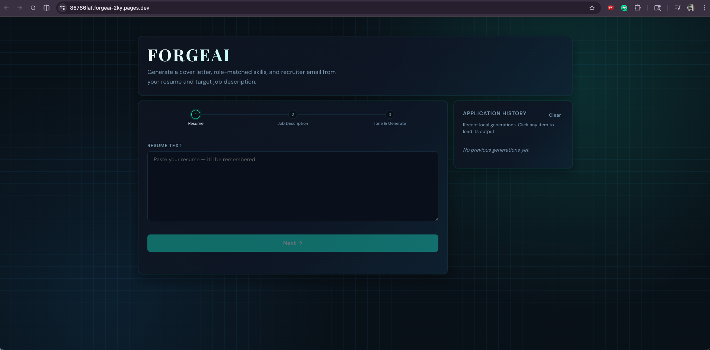
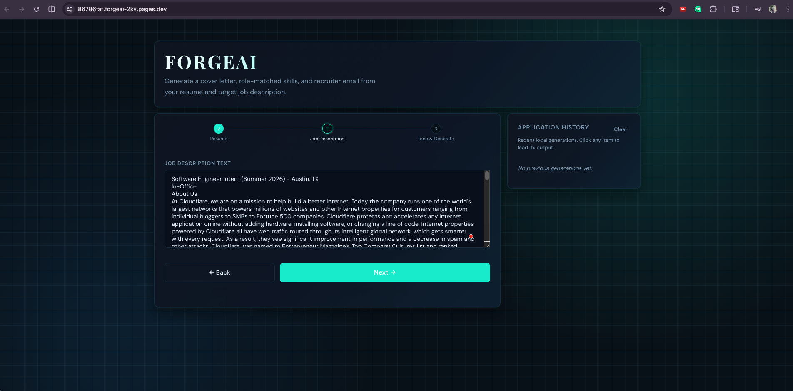
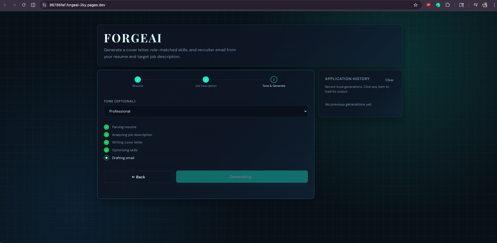
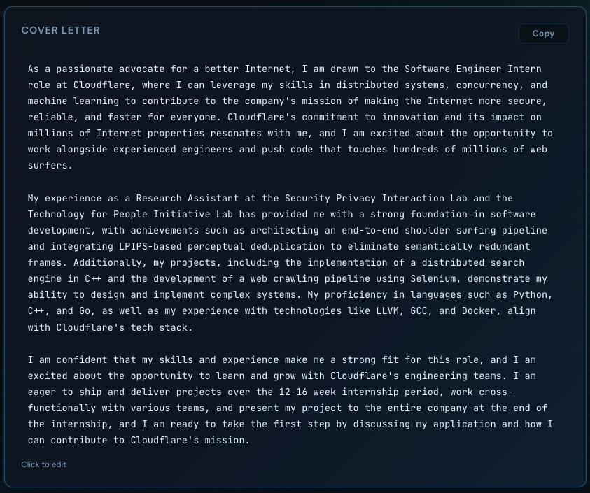
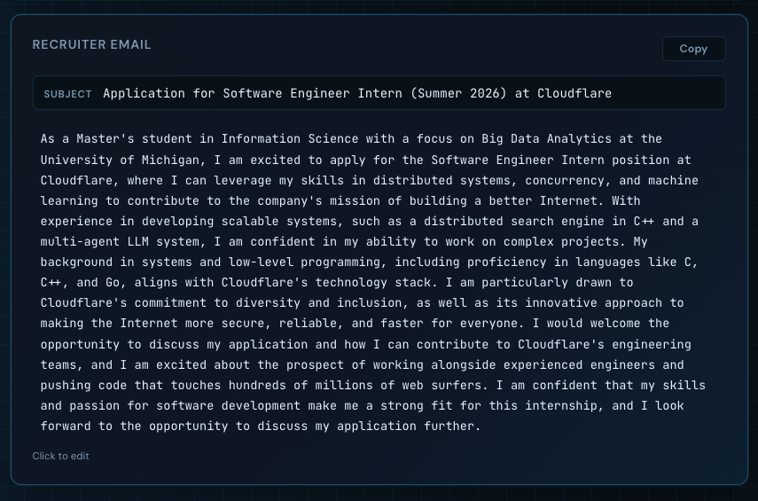

# forgeAI

forgeAI is an AI job-application assistant built on Cloudflare.

Given:
- Resume text
- Job description text

It generates three outputs:
1. A tailored cover letter
2. A list of relevant skills
3. A recruiter-ready email

The frontend includes a guided 3-step flow, local draft persistence, and application history.

## Why this project
This project was built as a minimal Cloudflare AI app with clear, practical UX:
- No auth
- No database
- Clean API contract
- Separate LLM calls per output for control and clarity

## Tech stack
- **Frontend**: Next.js (deployed to Cloudflare Pages)
- **Backend**: Cloudflare Worker (TypeScript)
- **Model**: Workers AI (Llama 3.3)
- **State/Memory**: Browser `localStorage` (draft + history)

## Architecture
- `web/`:
  - Next.js UI
  - 3-step input flow (Resume -> Job Description -> Tone)
  - Copy buttons, editable outputs, history sidebar
- `worker/`:
  - `POST /api/generate`
  - Validates input size/content
  - Runs **3 separate AI calls**:
    - cover letter
    - skills
    - email


## API
### `POST /api/generate`
Request:
```json
{
  "resume": "string",
  "job_description": "string",
  "tone": "professional"
}
```

Response:
```json
{
  "cover_letter": "...",
  "skills": ["..."],
  "email": "..."
}
```

## Tutorial: run locally

### 1) Clone and install
```bash
git clone <your-repo-url>
cd <repo-folder>
```

### 2) Configure backend env
```bash
cd worker
cp .dev.vars.example .dev.vars
```

Add values in `worker/.dev.vars`:
```env
CF_ACCOUNT_ID=your_cloudflare_account_id
CF_API_TOKEN=your_workers_ai_token
AI_MODEL=@cf/meta/llama-3.3-70b-instruct-fp8-fast
```

### 3) Start Worker
```bash
cd worker
npm install
npm run dev
```
Worker runs on `http://127.0.0.1:8787`.

### 4) Start frontend
```bash
cd web
npm install
npm run dev
```
Frontend runs on `http://127.0.0.1:8788`.

### 5) Test
- Open `http://127.0.0.1:8788`
- Paste resume + JD
- Generate outputs


## Tutorial: deploy to Cloudflare

### 1) Login
```bash
npx wrangler login
npx wrangler whoami
```

### 2) Deploy Worker
```bash
cd worker
npm run deploy
```

Set production secrets:
```bash
npx wrangler secret put CF_ACCOUNT_ID
npx wrangler secret put CF_API_TOKEN
npm run deploy
```

Save your Worker URL (example):
`https://cd-ai-forgeai.<subdomain>.workers.dev`

### 3) Deploy frontend (Pages)
Build static export:
```bash
cd web
npm run build
```

Deploy:
```bash
npx wrangler pages deploy out --project-name forgeai
```

### 4) Verify end-to-end
- Open deployed Pages URL
- Generate using sample inputs
- Confirm all 3 outputs are returned

## Screenshots
Current screenshots are stored in `demo/`:

1. Landing page flow  


2. Job description step  


3. Generation in progress  


4. Cover letter output  


5. Email output  


6. Skills output  


## Troubleshooting

### `ERR_CONNECTION_REFUSED 127.0.0.1:8787`
Your frontend is trying local API while Worker is not running.
- Start Worker locally, or
- Clear stale local setting:
```js
localStorage.removeItem('apiBase')
location.reload()
```

### `Missing AI config. Set CF_ACCOUNT_ID and CF_API_TOKEN`
Production secrets are missing in Worker. Re-run:
```bash
wrangler secret put CF_ACCOUNT_ID
wrangler secret put CF_API_TOKEN
npm run deploy
```

### `Service unavailable [code: 7010]` during Pages deploy
Cloudflare transient issue. Retry in a minute or deploy via Pages dashboard.

## Security notes
- Never commit `.dev.vars`
- Rotate any token if exposed
- Keep API tokens in Wrangler secrets for production

## Live Demo
[forge-ai-demo](https://86786faf.forgeai-2ky.pages.dev/)